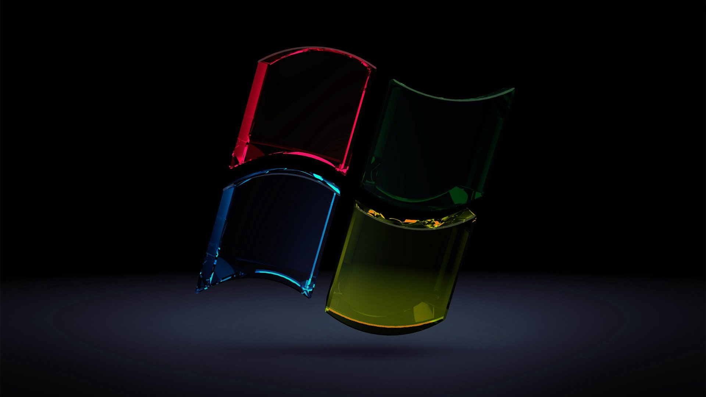

<!DOCTYPE html>
<html lang="ta">
<head>
    <meta charset="UTF-8">
    <meta name="viewport" content="width=device-width, initial-scale=1.0">
    <title>Happy Birthday Chlooooo 🎉</title>
    
</head>
<body>

    <audio id="bgMusic" loop>
        <source src="Kannana-Kanne.mp3" type="audio/mpeg">
    </audio>

    <button class="music-btn" onclick="toggleMusic()" id="musicBtn">🎵 Play Music</button>

    

        
        <!-- Page 1: Welcome -->
        

            <h1>🎉 Birthday Special! ✨</h1>
            
Happy Birthday Chlooooo 🎂

            
Unakkaga oru chinna surprise ready panni irukken! Keela irukkira button-a click pannu!

            <button class="btn" onclick="nextPage(2)">Next Page ➔</button>
        

        <!-- Page 2: Special Wish -->
        

            <h1>🌟 Special Wish</h1>
            
Intha naal unakku romba santhoshathaiyum, unoda ellaa kanavugalum niraveruradhuku ennode manamaarndha vaazhthukkal! ❤️

            

                <button class="btn btn-secondary" onclick="nextPage(1)">⬅ Back</button>
                <button class="btn" onclick="nextPage(3)">See Memories 📸 ➔</button>
            

        

        <!-- Page 3: 📸 NEW PHOTO GALLERY -->
        

            <h1>📸 Sweet Memories</h1>
            
            

                <!-- Inga unga photos link-a maathikonga -->
                
                
                
            

            

                <button class="gallery-btn" onclick="changePhoto(-1)">◀ Prev</button>
                1 / 3
                <button class="gallery-btn" onclick="changePhoto(1)">Next ▶</button>
            

            

                <button class="btn btn-secondary" onclick="nextPage(2)">⬅ Back</button>
                <button class="btn" onclick="nextPage(4)">Surprise Gift 🎁 ➔</button>
            

        

        <!-- Page 4: Gift Surprise -->
        

            <h1>🎁 Tap the Gift Box!</h1>
            
Unakkana Secret Wish keela irukkura gift box ullae irukku, click panni paar!

            
🎁

            

                 Keep smiling always! Un sirippu dhaan unakku azhage! Unakku oru semma grand party wait pannudhu! 🥳🎂
            

            

                <button class="btn btn-secondary" onclick="nextPage(3)">⬅ Back</button>
                <button class="btn" onclick="nextPage(5)">Final Surprise 🎉</button>
            

        

        <!-- Page 5: Celebration Page -->
        

            <h1>🥳 Grand Blast! 🎆</h1>
            
Annapoorani Chlooooo

            
Have an incredible year ahead full of love, success, and happiness! Enjoy your day to the fullest! 🎈✨

            <button class="btn btn-secondary" onclick="nextPage(1)">🔄 Start Again</button>
        

    

    
</body>
</html>
